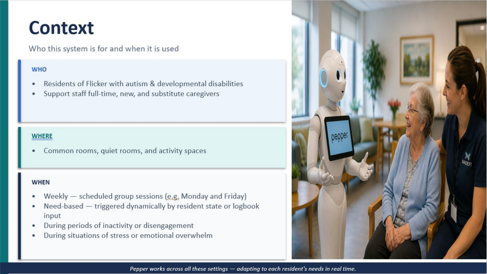
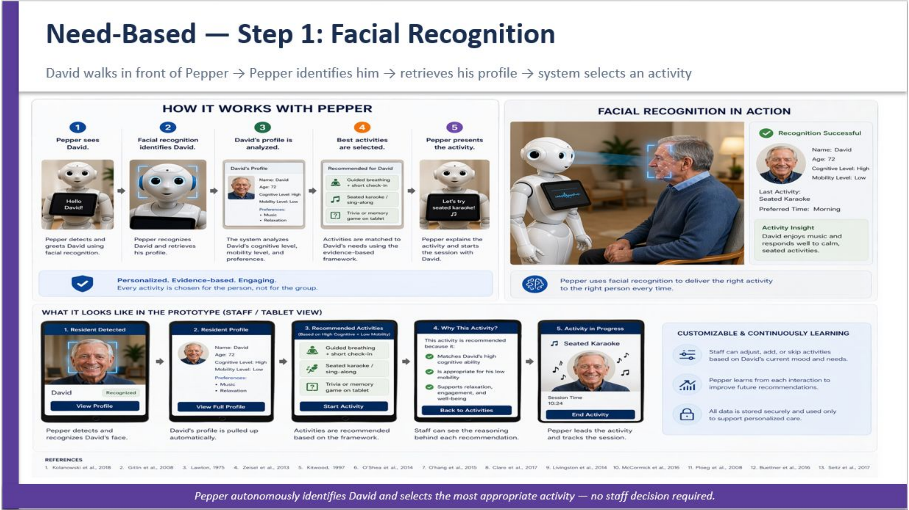
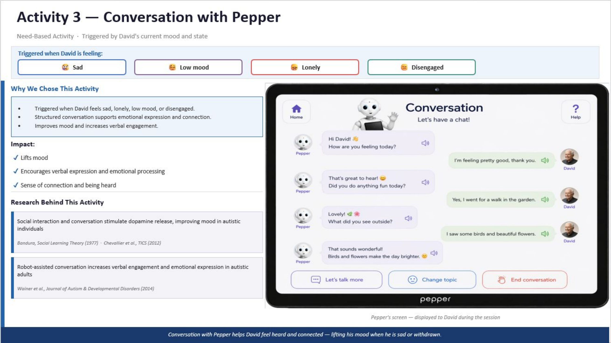
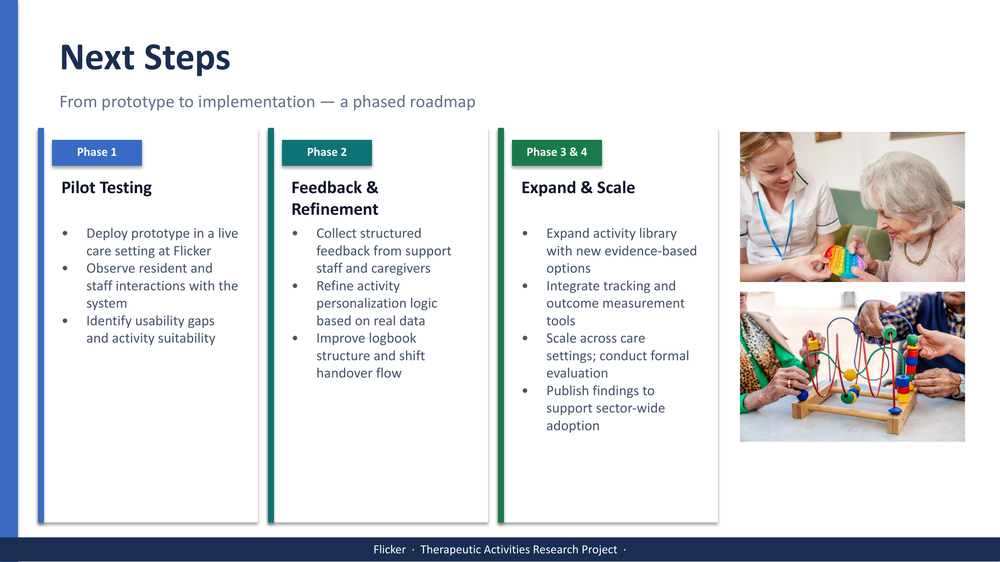

# Pepper Robot Therapeutic Activities Prototype

## Project Overview
This project presents an AI-assisted no-code prototype for delivering personalized therapeutic activities using Pepper Robot. The concept focuses on supporting residents with autism and developmental disabilities through structured, evidence-informed therapeutic activities that can be adapted to each resident’s abilities, emotional state, and support needs.

This is a prototype concept created for academic and portfolio purposes. It is not a deployed clinical, healthcare, or production system.

## My Contribution
My contribution focused on therapeutic activity research, activity recommendation logic, user-flow design, and AI-assisted no-code prototype creation.

I worked on:

- Researching therapeutic activities suitable for residents with autism and developmental disabilities
- Proposing activity categories such as sensory stimulation, chair yoga, conversation/storytelling, music therapy, and breathing/meditation
- Designing activity recommendation logic based on cognitive/communication ability, mobility level, emotional state, and resident needs
- Creating AI-assisted no-code prototype screens using Claude
- Mapping Pepper Robot interaction flows for weekly and need-based therapeutic activities
- Designing resident profile, facial recognition concept, activity recommendation, and logbook workflow
- Presenting the concept as a structured, evidence-informed therapeutic support system

## Problem
Residents may have limited access to personalized therapeutic activities that match their individual abilities, needs, or current emotional state. Without matched activities, residents may show low participation, increased stress, restlessness, and reduced quality of interaction.

Support staff may also face cognitive burden when they need to identify, select, and justify the right activity in real time, especially during busy shifts or when new/substitute caregivers are involved.

## Proposed Solution
The proposed solution is a simple and adaptable system where Pepper Robot supports staff and residents by recommending therapeutic activities based on resident profiles, logbook information, and facial recognition concept flow.

The system is designed to:

- Personalize activities using resident profiles
- Reduce staff cognitive load
- Support new or substitute caregivers
- Deliver multi-sensory therapeutic activities
- Make activity facilitation easier and more consistent
- Record outcomes through a logbook-based tracking approach

## Activity Framework
The project uses two activity models:

### Weekly Activities
Structured group activities scheduled for residents, such as chair yoga and music-based activities.

### Need-Based Activities
Personalized activities triggered by a resident’s current emotional state, facial recognition concept flow, resident profile, or logbook input.

The activity logic considers:

- Cognitive / communication ability
- Mobility level
- Emotional state
- Resident preferences
- Prior logbook observations
- Current need or moment of disengagement/stress

## Prototype Features
The AI-assisted no-code prototype includes:

- Resident profile view
- Facial recognition concept flow
- Activity recommendation screen
- Weekly activity mode
- Need-based activity mode
- Therapeutic activity interface
- Logbook-based tracking
- Mood and engagement recording
- Staff handover support
- Activity progress tracking

## Tools Used
- Claude — AI-assisted no-code prototype screen generation and concept development
- PowerPoint — project presentation and prototype documentation
- Research-based activity planning
- User-flow design
- Therapeutic activity framework design
- Product concept development

## Project Screenshots

### Problem Overview

### Therapeutic Activity Research

### Proposed Solution

### Facial Recognition Prototype

### Logbook Tracking Prototype

### Therapeutic Activity Interface

## Project Document
The full project presentation is available here:

[Pepper Robot Therapeutic Activities Prototype PDF](docs/Pepper_Robot_Therapeutic_Activities_Prototype.pdf)

## Impact
The prototype is designed to support both residents and staff.

For residents, the concept aims to support:

- Increased participation and engagement
- Reduced stress, agitation, and distress
- Improved mood and emotional regulation
- Consistent and predictable therapeutic routines
- Activities matched to individual needs and preferences

For staff, the concept aims to support:

- Reduced real-time activity selection burden
- Lower cognitive load for new or substitute staff
- Clearer shift handover through logbook-based tracking
- More consistent care delivery
- Better use of structured activity records

## Future Improvements
Future improvements could include:

- Pilot testing in a care setting
- Collecting structured feedback from staff and caregivers
- Refining activity personalization logic using real-world data
- Improving the logbook and shift handover flow
- Expanding the therapeutic activity library
- Adding outcome measurement and tracking tools
- Conducting formal evaluation before real-world implementation

## Skills Demonstrated
- Therapeutic activity research
- AI-assisted no-code prototyping
- User journey mapping
- Product concept development
- Activity recommendation logic
- Healthcare technology concept design
- Human-centered design thinking
- Workflow documentation
- Prototype presentation and storytelling
